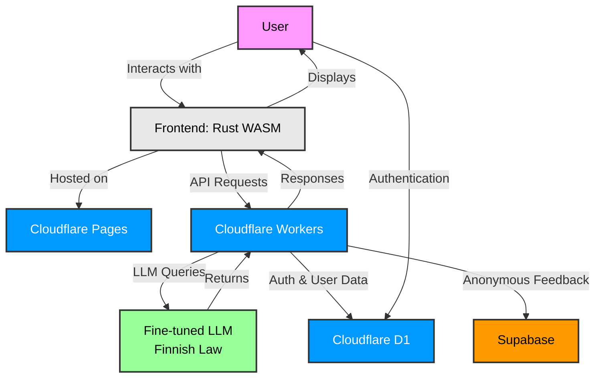

# Orange Soft Biscuit

> Making Legal Aid Accessible to Everyone, see the service at [`lagen.fi`](https://lagen.fi/)

Orange Soft Biscuit is a project dedicated to democratizing access to legal assistance through the power of fine-tuned large language models (LLMs) specialized in Finnish law and legislation.

### Mission

Our goal is to bridge the gap in legal accessibility by leveraging AI technology to provide accurate, timely, and understandable legal guidance in Finnish. We believe that everyone deserves access to reliable legal information, regardless of their background or financial situation.

### How It Works

The platform utilizes a fine-tuned language model trained on Finnish legislation and legal frameworks to deliver contextual legal guidance through an intuitive chat interface. Users can ask questions about Finnish law in their own language and receive clear, actionable responses.

#### Project Architecture

### Technology Stack

Orange Soft Biscuit is built on a modern, performant stack:

- **Frontend**: Rust compiled to WebAssembly (WASM) for fast, efficient client-side execution
- **Hosting**: Cloudflare Pages for global edge delivery and static site hosting
- **Backend**: Cloudflare Workers for serverless, high-performance API endpoints
- **Database**: Cloudflare D1 for edge-distributed data storage
- **User Data**: Supabase for authentication and additional data persistence

This architecture ensures low-latency responses, scalability, and cost efficiency while maintaining user privacy and data security.

### Vision

We envision a world where legal knowledge is not a privilege, but a fundamental right. By combining cutting-edge AI with accessible technology, Orange Soft Biscuit aims to empower Finnish citizens and organizations with the legal insights they need to navigate complex legislative landscapes with confidence.
